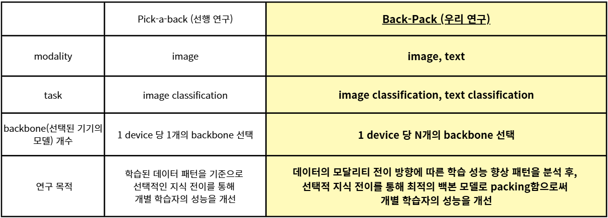

<!-- Template for PROJECT REPORT of CapstoneDesign 2025-2H, initially written by khyoo -->
<!-- 본 파일은 2025년도 컴공 졸업프로젝트의 <1차보고서> 작성을 위한 기본 양식입니다. -->
<!-- 아래에 "*"..."*" 표시는 italic체로 출력하기 위해서 사용한 것입니다. -->
<!-- "내용"에 해당하는 부분을 지우고, 여러분 과제의 내용을 작성해 주세요. -->

# Team-Info
| (1) 과제명 | Back-Pack: Collaborative Knowledge Transfer with Diverse Backbone Selection Beyond Modality |
|:---  |---  |
| (2) 팀 번호 / 팀 이름 | 07-테스파 |
| (3) 팀 구성원 | 조민주(2176359): 리더, Perceiver 모델 개발 및 실험, 실험 환경 관리, Multi-modal 실험환경 개발, 1:N Backbone model 구축 및 개발, Scalability Test   정지수(2176352): 팀원, Perceiver IO 모델 개발 및 실험, Dataset 전처리, Backbone model 선택 실험, Scalability Test   한유리(2271065) : 팀원, BEiT-3 모델 개발 및 실험, 실험 서버 관리, Dataset 호환성 관리, Backbone model 선택, 실험 설계 및 통계적 검정, Scalability Test			 |
| (4) 팀 지도교수 | 이형준 교수님 |
| (5) 과제 분류 | 연구 과제 |
| (6) 과제 키워드 | Continuous learning, 1:N Federated learning, Edge AI, Multi-modality  |
| (7) 과제 내용 요약 | 분산형 지속 학습 환경에서는 다양한 백본(backbone) 모델을 사용하는 각 디바이스 간에 과제(task)와 모달리티(image, text)를 넘나드는 지식 전이가 큰 도전 과제로 남아 있다.   본 연구에서는 Back-Pack이라는 협업 학습 프레임워크를 제안하여, 디바이스마다 여러 개의 backbone을 유지하면서 이미지와 텍스트 간, 혹은 동일 모달 내에서 선택적으로 지식을 다중전이할 수 있도록 한다.   우리는 지속적인 분류 학습 환경에서 지식 전이의 방향성에 따라 성능이 일관되게 향상되는 경향이 있음을 실험적으로 관찰하였고, 다수의 모델에서 추출한 지식을 하나의 백본에 융합(packing)할 경우 추가적으로 성능 향상을 확인하였다.   본 연구는 분산형 다모달 지속학습 환경에서 지식전이의 방향성과 모델 융합 전략이 핵심적인 요소임을 실증적으로 밝힌다. |

 

# Project-Summary
| 항목 | 내용 |
|:---  |---  |
| (1) 문제 정의 | 1. 이질적인 data와 다양한 modality, multiple task 환경에서 edge간 학습할 때 효율적인 Continual Learning 알고리즘 부재, Catastrophic Forgetting 문제 발생   2. decentralized 환경에서 raw data를 공유함으로써 발생하는 communicational/computational cost 문제   3. Cross/intra-modal backbone으로부터 knowledge transfer 시, 특정한 학습 패턴을 파악해볼 수 있을 것   4. device-to-device knowledge transfer 방식은 device간 collaborative한 transfer 방식보다 학습 효과가 낮을 것 |
| (2) 기존연구와의 비교 | - 선행 연구: Pick-a-back: Selective Device-to-Device Knowledge Transfer in Federated Continual Learning, ECCV24   - Pick-a-back(선행 연구)의 핵심 아이디어   1. 각 device가 데이터를 공유하지 않고 독립적으로 학습   2. 자신과 유사한 데이터 패턴을 가진 기기의 모델을 선택적으로 가져와서 자신의 지식을 전달   3. 기존의 Catastrophic Forgetting 문제를 방지하면서 continual learning 가능    |
| (3) 제안 내용 | 1) 1:N Knowledge Transfer algorithm   N개의 장치에서 학습한 지식을 그룹화하여 분류 후 장치끼리의 지식 전달하는 clustering 알고리즘 개발   모델 간 지식 융합 실험: 여러 모델의 지식을 하나의 모델로 통합하여 지식 전이했을 때 성능 향상이 있는지 검증   2) Multi-modality   다양한 모달리티의 데이터를 embedding space 상 표현하여 edge 간 전이   교차, 단일 모달 내 지식전이 실험: 특정 전이 방향이 지속적으로 학습 성능을 향상시키는지 검증   3) Decentralized Continual Learning   중앙 서버가 없는 환경에서 지속적으로 들어오는 task에 대해 Catastrophic Forgetting 현상을 최소화하는 알고리즘 구축   Decentralized Continual learning 환경 구축: backbone 모델로부터 지속적으로 task를 학습시킬 수 있도록 환경 구축 |
| (4) 기대효과 및 의의 | 데이터의 모달리티 전이 방향에 따른 학습 성능 향상 패턴을 분석 후, 선택적 지식 전이를 통해 최적의 백본 모델로 packing함으로써 개별 학습자의 성능을 개선 |
| (5) 주요 기능 리스트 | *(3)에서 제안한 해결책들을 지원or구현하기 위하여 필요한 주요 기능 혹은 기능을을 List-up하고,   각각에 대하여 설명*   * 본 항목의 내용을 충실히 기재 바람니다. *|

 
 
# Project-Design & Implementation
| 항목 | 내용 |
|:---  |---  |
| (1) 요구사항 정의 | *프로젝트를 완성하기 위해 필요한 요구사항을 설명하기에 가장 적합한 방법을 선택하여 기술*   예)   - 기능별 상세 요구사항(또는 유스케이스)   - 설계 모델(클래스 다이어그램, 클래스 및 모듈 명세서)   - UI 분석/설계 모델   - E-R 다이어그램/DB 설계 모델(테이블 구조) |
| (2) 전체 시스템 구성 |  |
| (3) 주요엔진 및 기능 설계 | *프로젝트의 주요 기능 혹은 모듈의 설계내용에 대하여 기술한다   SW 구조 그림에 있는 각 Module의 상세 구현내용을 자세히 기술한다.* |
| (4) 주요 기능의 구현 | *<주요기능리스트>에 정의된 기능 중 최소 2개 이상에 대한 상세 구현내용을 기술한다.* |
| (5) 기타 | *기타 사항을 기술*  |

 
